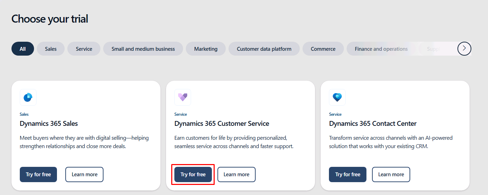

---
lab:
    title: 'Lab: Validate lab environment'
    module: 'Module 0: Course introduction'
---

# TW-7004: Implement the Modern Customer Service Experience

## Scenario

In this Module 0 lab, you will validate that your classroom tenant is working as expected. You will access your individual credentials, record your "alias", and open the Dynamics 365 model-driven application that we will be using throughout the course.

**Important notice for instructors:** Please do not make any changes, including adding licenses or changing tenant password. Tenants are fully provisioned with all necessary licenses, environments, and applications to complete the required tenants. Instructors and students should not add any additional functionality outside of the published lab steps. Adding additional functionality will cause the tenant to break and become inactive, and changing tenant password will inhibit the recycling of the tenant for the next class. Thank you for your cooperation.

**Important notice for instructors and students:** This lab will provide you with an actual Dynamics 365 tenant and licenses for the Power Platform applications you will be using in this course. Please be aware that the Power Platform is evolving all the time. The instructions in this document may be different from what you experience in your actual tenant. It is also possible to experience a delay of several minutes before the virtual machine has network connectivity to begin the labs.

## Exercise 1 - Access the Dynamics 365 application

### Task 1 – Start the Dynamics 365 Customer Service free trial

1. In a browser, go to https://www.microsoft.com/en-us/dynamics-365/free-trial. 

1. Scroll down and locate the **Dynamics 365 Customer Service** tile, then select the **Try for free** button.

    

1. In the *Let's get started* screen, enter the credentials that were provided to you as part of your lab environment, select the checkbox for the agreement, then select **Start your free trial**.

1. If prompted to enter a phone number, enter **0123456789**, then select **Submit**.

    **Note:** Your trial will launch. It may take a few minutes for your environment to open.

1. In the top header, select **Customer Service workspace** to open your list of available apps. 

    

1. Select **Customer Service Hub** to open the application.

    

1. Spend a few minutes exploring the application.

### Task 2 – Sign in to the Power Platform admin center

1. In a new tab, go to https://admin.powerplatform.microsoft.com.

1. Record your user credential up to the **@** symbol on a scratch piece of paper or in Notepad. This will be your lab alias that you will use to differentiate the data you create within the shared Dynamics 365 organization.

    **Important:** Please be aware that this tenant and the Dynamics 365 organization will be shared with the other students in your classroom, like employees would share a tenant when using the Dynamics 365 instance belonging to their organization. Do not use any PII (personally identifiable information) when creating records. It is also good practice to use your user's prefix (ex., **mollyc**) in front of all records, data, apps, flows, etc. that you create.

1. Feel free to explore the Power Platform admin center but **do not make any changes**.
